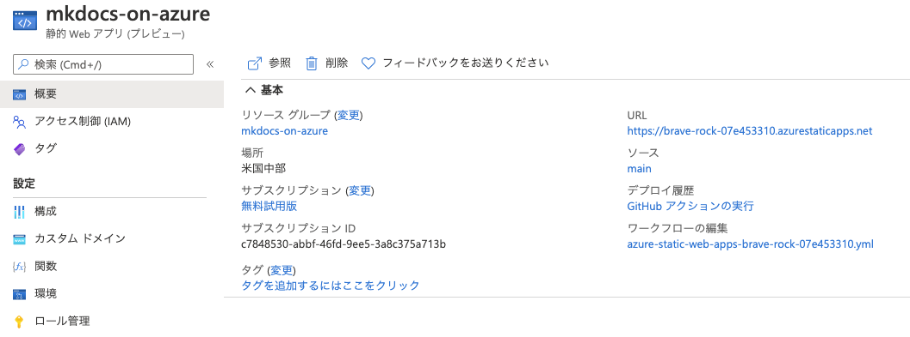
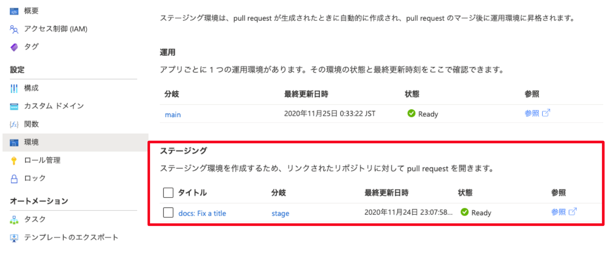
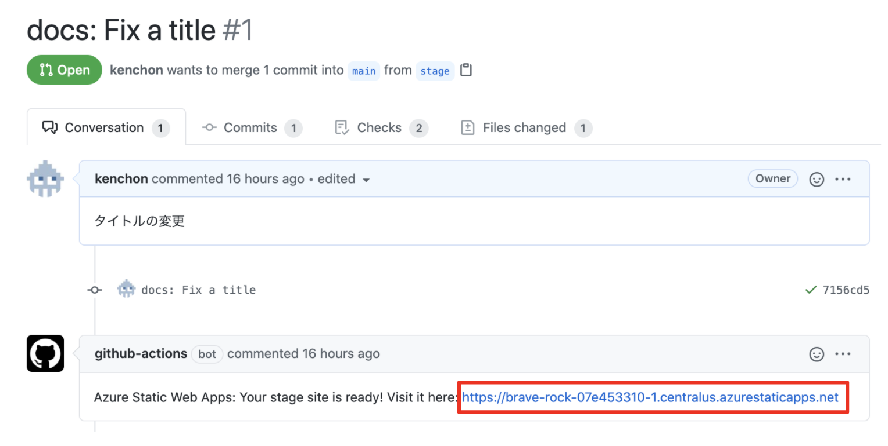

## 📚　ページの確認

ちゃんとデプロイできたかどうか，Azure Portal をみてみましょう！

概要欄からウェブサイトの URL をクリックして，所望のページが見えればおｋです。

## 🌐　環境ごとのデプロイ

Static Web Apps では，環境ごとのデプロイを設定レスでやってくれます。

例えば，ステージング用のブランチ `stage` を作って PR を出すと，PR を契機に自動でステージング環境用の静的サイトをデプロイしてくれます。

生成されたウェブページは GitHub の PR 画面から直接アクセスできます。PR から差分とデプロイ結果が一目でわかるのでレビューが楽になります。

