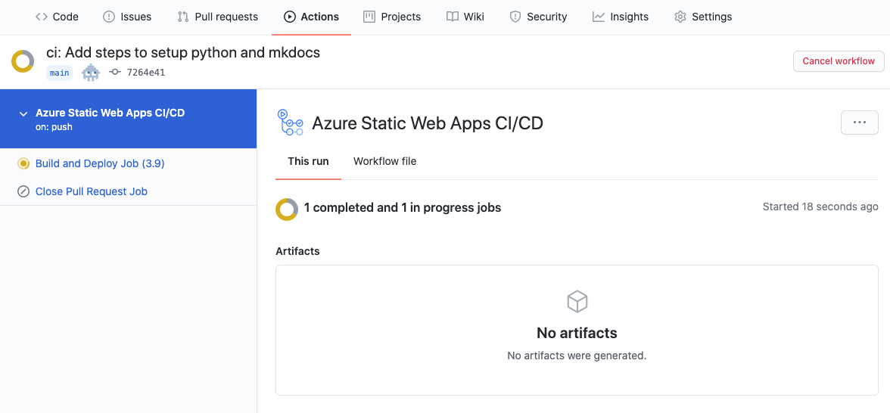

> **想定所要時間：5分**

## ✍️　パイプラインの修正

前の記事で Azure 上に Static Web Apps のリソース作成を行い，リポジトリには GitHub Actions のパイプライン設定ファイルが自動で生成されました。

しかし，自動生成された設定ファイルのままだとパイプラインは失敗します。理由は，以下の内容が不足しているからです：

1. GitHub Actions の仮想マシンでの Python 実行環境セットアップ
2. mkdocs と mkdocs-material のインストール
3. ビルドして `/site` ディレクトリに HTML,CSS,JS を生成する処理

ということで，`uses: actions/checkout@v2` 以降に，それぞれのジョブを以下のように追加してみました：

```yaml
    steps:
      - uses: actions/checkout@v2

      # 1. GitHub Actions の仮想マシンでの Python 実行環境セットアップ
      - name: Set up Python 3.9
        uses: actions/setup-python@v2
        with:
          python-version: 3.9

      # 2. mkdocs と mkdocs-material のインストール
      - name: Install Python dependencies
        run: |
          python -m pip install --upgrade pip
          pip install mkdocs
          pip install mkdocs-material

      # 3. ビルドして `/site` ディレクトリに HTML,CSS,JS を生成する
      - name: Build Web App
        run: |
          mkdocs build --clean
```

## 🚀　push & deploy!

それでは更新した内容で commit & push しましょう！

```bash
git add .
git commit -m "ci: Add steps to setup python and mkdocs"
git push origin main
```

※ push すると自動でデプロイが走ります。

GitHub Actions の画面を開くと，パイプラインが走っているのが見えます。



だいたい 2分ほどでデプロイが完了します。
